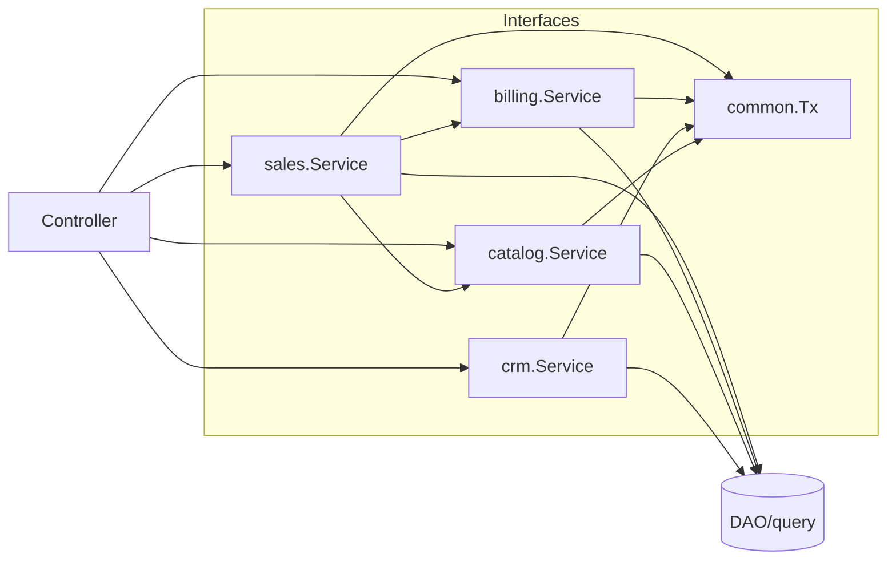

## 领域边界与依赖关系

### 分层与域
- internal/domains
  - catalog：产品域（查询、可售校验）
  - billing：钱包域（扣减/入账/幂等/真相表）
  - sales：订单域（下单/退款、事务收口、快照、出箱）
  - crm：客户与联系人域
- internal/common：事务、错误、审计、outbox

### 依赖关系（Mermaid）

### 边界约束
- Controller 仅依赖域接口，不直接访问 DAO。
- 订单状态与钱包变更仅能由 `sales.Service` 在事务内修改。
- 钱包余额只读，所有变更由 `billing.Service` 产生交易并原子更新。

