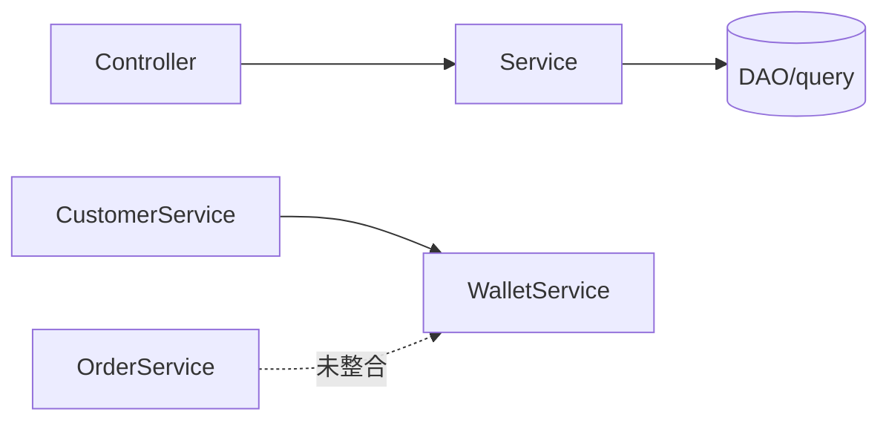

## CRM Lite 项目勘察报告（第 0 步）

本报告为只读分析结果：目录结构（≤3 层）、服务清单与简要调用图、数据库表与索引概览、风险点与建议迁移顺序。后续将在独立 PR 中逐步落地重构。

### 1. 目录结构（≤3 层）

- internal/
  - bootstrap/
  - captcha/
  - controller/（HTTP 控制器）
  - core/
    - config/
    - logger/
    - resource/（DB/Cache/Casbin 等资源管理）
  - dao/
    - model/（gorm-gen 数据模型）
    - query/（gorm-gen 查询封装，含 Transaction、Begin/Commit/Rollback 封装）
  - dto/
  - middleware/（JWT、CORS、权限、访问控制等）
  - policy/
  - routes/
  - service/（当前“粘连式服务”所在）
  - startup/

- db/
  - migrations/（SQL 迁移脚本）

- config/
  - app.dev.yaml / app.prod.yaml / app.test.yaml / app.env

说明：项目无顶层 `controller/`、`routes/`、`middleware/` 目录，均位于 `internal/` 下；业务 DAO 亦集中在 `internal/dao`。

### 2. 已实现服务与调用关系（简要矩阵）

- AuthService（internal/service/auth_service.go）
  - 方法：Login/Register/Logout/RefreshToken/ForgotPassword/ResetPassword/UpdateProfile/GetProfile/ChangePassword
  - 被谁调用：`internal/controller/auth_controller.go`
  - 依赖：AuthRepo、AuthCache、EmailService、Casbin

- UserService（internal/service/user_service.go）
  - 方法：GetUserByUUID/CreateUserByAdmin/ListUsers/UpdateUserByAdmin/DeleteUser
  - 被谁调用：`internal/controller/user_controller.go`
  - 依赖：gorm-gen `query`，并在多处使用 `q.Transaction(...)`

- RoleService（internal/service/role_service.go） / PermissionService（internal/service/permission_service.go）
  - 方法：角色 CRUD、权限绑定/解绑、查询
  - 被谁调用：`internal/controller/role_controller.go`、`internal/controller/permission_controller.go`
  - 依赖：Casbin、gorm-gen `query`

- ProductService（internal/service/product_service.go）
  - 方法：CreateProduct/GetProductByID/ListProducts/UpdateProduct/DeleteProduct
  - 被谁调用：`internal/controller/product_controller.go`
  - 依赖：产品仓储（在同文件实现的 repo）

- CustomerService（internal/service/customer_service.go）
  - 方法：CreateCustomer/ListCustomers/GetCustomerByID/UpdateCustomer/DeleteCustomer
  - 被谁调用：`internal/controller/customer_controller.go`
  - 依赖：CustomerRepo、IWalletService（用于新建客户时创建钱包）

- ContactService（internal/service/contact_service.go）
  - 方法：List/GetContactByID/Create/Update/Delete
  - 被谁调用：`internal/controller/contact_controller.go`

- OrderService（internal/service/order_service.go）
  - 方法：CreateOrder/GetOrderByID/ListOrders（内含事务，但未整合支付/钱包）
  - 被谁调用：`internal/controller/order_controller.go`

- WalletService（internal/service/wallet_service.go）
  - 接口 IWalletService：CreateWallet/CreateTransaction/GetWalletByCustomerID/GetTransactions/ProcessRefund
  - 被谁调用：`internal/controller/wallet_controller.go`，以及 `CustomerService`（创建客户时）
  - 依赖：gorm-gen `query`，使用 `q.Transaction(...)`

- DashboardService/MarketingService/HierarchyService
  - 被谁调用：对应 controller 或中间件（如层级访问）

简要调用图（高层）：



### 3. 数据库清单（主要表与字段）

- wallets（余额表，当前可写）
  - 字段：id, customer_id, type, balance, frozen_balance, total_recharged, total_consumed, created_at, updated_at
  - 索引：UNIQUE(customer_id,type), idx_wallets_balance

- wallet_transactions（钱包流水：recharge/consume/refund/...）
  - 字段：id, wallet_id, type, amount, balance_before, balance_after, source, related_id, remark, operator_id, created_at
  - 索引：wallet_id/type/source/related_id/created_at/operator_id（多列索引）

- orders / order_items（订单与明细）
  - orders：id, order_no, customer_id, contact_id, order_date, status, payment_status, total_amount, discount_amount, final_amount, payment_method, remark, assigned_to, created_by, created_at, updated_at, deleted_at
  - order_items：id, order_id, product_id, product_name, quantity, unit_price, discount_amount, final_price, created_at
  - 索引：orders（customer_id+order_date、status、payment_status+payment_method、assigned_to、order_no 唯一），order_items（order_id）

- products
  - 字段：id, name, description, type, category, price, cost, stock_quantity, min_stock_level, unit, is_active, created_at, updated_at, deleted_at

- customers / contacts
  - customers：id, name, phone(唯一), email, gender, birthday, level, tags, note, source, assigned_to, created_at, updated_at, deleted_at
  - contacts：id, customer_id, name, phone, email, position, is_primary, note, created_at, updated_at, deleted_at

- 其余（存在但此处略过字段细节）：admin_users, roles, casbin_rules, admin_user_roles, activities, marketing_campaigns, marketing_records, migrations

### 4. 风险点扫描与证据

- 钱包余额被直接更新（违反“余额只读”）

  证据：`internal/service/wallet_service.go` 在事务中直接 `Updates` 写入 `balance/total_*`。

```168:206:/Users/yt/Documents/developer/crm_lite/internal/service/wallet_service.go
        _, err = tx.Wallet.WithContext(ctx).Where(tx.Wallet.ID.Eq(wallet.ID)).
            Updates(map[string]interface{}{
                "balance":         newBalance,
                "total_consumed":  newTotalConsumed,
                "total_recharged": newTotalRecharged,
            })
        if err != nil {
            return err
        }
        ...
        _, err = tx.Wallet.WithContext(ctx).Where(tx.Wallet.ID.Eq(wallet.ID)).
            Updates(map[string]interface{}{
                "balance": bonusAfter,
            })
```

- 未使用行级锁（FOR UPDATE）
  - 全局检索未发现 `FOR UPDATE`；并发下余额计算存在竞争风险。

- 幂等性缺失
  - 全局检索未发现 `Idempotency/Idem/SETNX` 相关实现；重复请求可能造成重复扣款/入账。

- 退款未收口到订单域
  - `WalletService.ProcessRefund` 校验订单后，直接产生退款流水，并未更新订单状态/支付状态；未形成 `sales.RefundOrder` 统一入口。

- 订单项“产品快照”字段不全
  - 当前 `order_items` 仅有 `product_name` 与 `unit_price`，无 `product_name_snapshot / unit_price_snapshot / duration_min_snapshot` 明确命名与语义。
  - 产品模型亦无 `duration_min` 字段，后续需补齐。

- 事务收口缺失
  - `OrderService.CreateOrder` 使用事务写订单与明细，但未与支付/钱包扣款打包为一个事务；“下单+扣款+出箱(outbox)”未统一。

- 跨层直查（架构边界不清）
  - `internal/controller/wallet_controller.go` 为解析操作员，直接访问 DB `admin_users`（绕过服务层封装）。

### 5. 建议迁移顺序（PR 切片）

1) 引入域包 + 接口（空实现）：`internal/domains/{catalog|sales|billing|crm}` 与 `internal/common/tx.go`
2) 迁移产品到 catalog（只做“搬家+接口”）
3) 迁移钱包到 billing，引入“钱包真相表 + 余额只读”与幂等键
4) 迁移订单到 sales：下单/退款统一事务收口，订单项快照字段补齐；对接 billing
5) DDL 迁移与端到端集成测试；补 outbox 表

### 6. 与目标规则的差距清单

- 钱包：
  - 余额需要只读（由 `wallet_transactions` 派生），当前直接 UPDATE；需改造为“插入流水 + 原子累计/派生更新”。
  - 交易需携带 idempotency_key 与业务引用（order/refund 等）。
  - Debit/Credit 接口需领域化：`DebitForOrder/CreditForRefund`。

- 订单：
  - `PlaceOrder` 内统一：拉取商品快照 → 写订单/明细（含快照）→ 钱包扣减 → outbox → COMMIT。
  - `RefundOrder` 内统一：订单状态置 refunded + 反向钱包交易（同一事务）。

- DDL：
  - 需要新增/补充：`bil_wallets`（或沿用 wallets 但改语义）、`bil_wallet_transactions`（幂等约束与索引）、`sal_order_items` 快照列、`sys_outbox` 表。

### 7. 结论

当前项目结构清晰，测试与 gorm-gen 设施完善；主要问题集中在“钱包余额可写、事务与幂等缺失、领域边界不清”。建议按上文 5 个切片实施，以确保每步可编译、可运行、可回滚，并逐步将订单/钱包一致性纳入领域事务收口。


